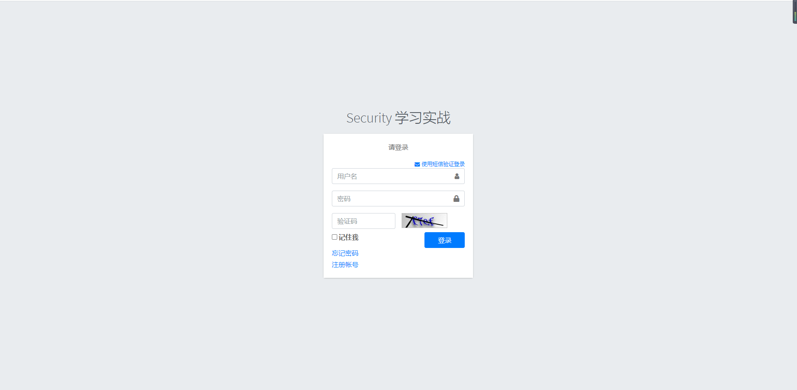
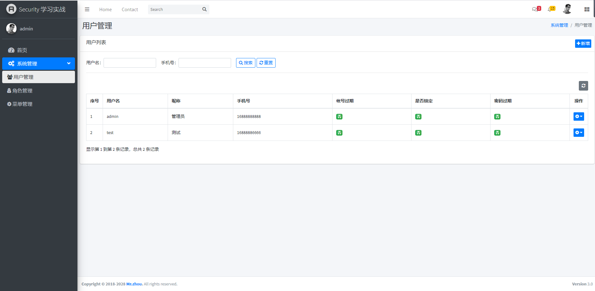
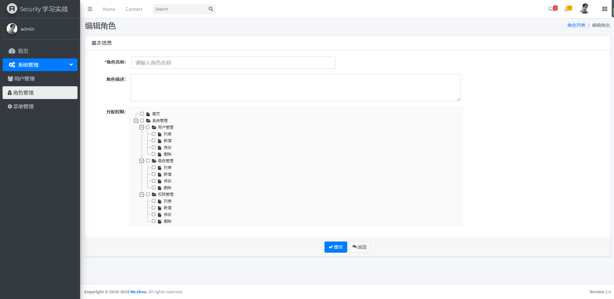
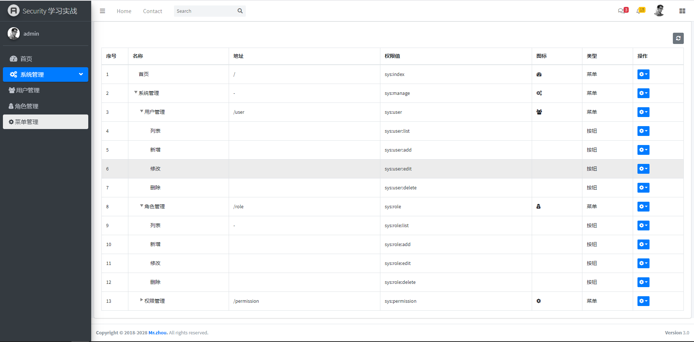

## Spring Security
#### 一、项目介绍
Spring Security是一个功能强大且高度可定制的身份验证和访问控制框架。且专注于为Java应用程序提供身份验证和授权的框架。

通过本项目可以迅速深入理解Spring Security底层的鉴权流程，以及更多的扩展鉴权方式，不仅可以提高和突破技术瓶颈，更能在项目开发中迅速集成权限框架。

#### 二、效果展示
- 登录

- 用户

- 角色

- 权限

#### 三、分支说明
3.1 SpringSecurity基础框架构建和静态资源：dev-resouse

3.2 SpringSecurity身份认证的方式：dev-v1.0.0
- HttpBasic 认证方式
- HttpForm 表单认证方式

3.3 SpringSecurity身份认证的方式：dev-v1.0.1
- 自定义登录页面
- 登录页面表单处理
- 动态认证用户信息
- 自定义成功失败处理器

3.4 SpringSecurity个性化认证与session会话管理：dev-v1.0.2
- 图形验证码功能
- remember-Me记住我功能
- 手机短信验证码功能
- 手机登录remember-Me记住我功能
- 获取当前用户认证信息
- 配置session会话超时
- 用户只能一个地方登录
- redis高可用集群
- 退出系统

3.5 SpringSecurity数据库动态认证RBAC权限认证：dev-v1.0.2
- 授权管理
- 结合mybatis-plus数据库动态认证
- rbac权限资源管理
- rbac角色资源管理
- rbac用户管理
- rbac权限控制菜单

#### 四、相关博客
- [SpringSecurity身份认证方式](https://zhouwenfang.com/archives/security1)

#### 五、个人博客站点

- [朽木自雕](https://zhouwenfang.com)

